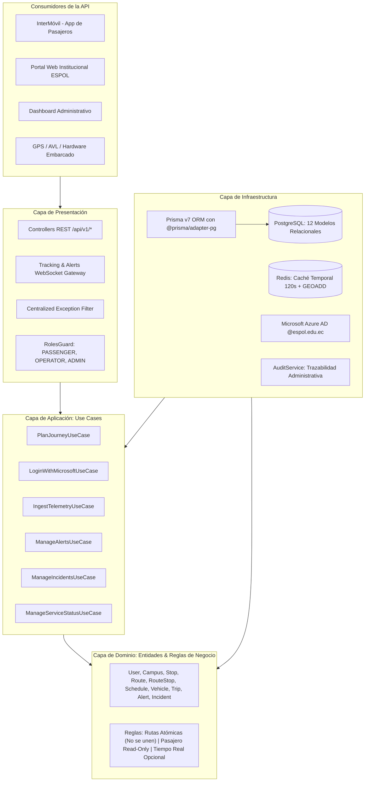

# 🚌 ESPOL MOVE ALERT — Mobility Backend API v1.0

Plataforma central y **Single Source of Truth** de los servicios de movilidad interna de la **Escuela Superior Politécnica del Litoral (ESPOL)**, Campus Gustavo Galindo Velasco.

Construido como un **Modular Monolith** con **Clean Architecture** en **NestJS 12**, **Prisma v7**, **PostgreSQL**, **Redis** y **WebSockets (Socket.IO)**.

---

## 🏛️ Arquitectura del Sistema (Clean Architecture)



---

## 🎯 Reglas Fundamentales del Negocio

1. **Rutas Atómicas e Independientes (Las rutas no se pueden unir):**
   - Cada recorrido opera como un circuito cerrado e inmutable. No existe combinación, concatenación ni encadenamiento entre rutas.
   - Un viaje (`Trip`) pertenece estrictamente a una sola ruta.
2. **Rol Pasajero: Estricta Visualización (Read-Only):**
   - El pasajero (estudiantes, profesores y comunidad general) **únicamente puede consultar**:
     - Visualizar rutas activas y paradas (`GET /api/v1/routes`, `GET /api/v1/routes/:id`).
     - Buscar paradas cercanas (`GET /api/v1/stops/nearby`).
     - Planificar viajes entre paradas/POIs (`POST /api/v1/journeys/plan`).
     - Consultar estado del servicio y alertas activas (`GET /api/v1/alerts`).
   - El pasajero **no tiene permisos para crear, editar, eliminar o alterar rutas ni emitir telemetría**.
3. **Tiempo Real Opcional (Resiliencia):**
   - La aplicación opera al 100% incluso ante ausencia total o interrupción de GPS. En tal caso, entrega horarios programados y recorridos oficiales sin inventar tiempos ficticios.
   - Las coordenadas de buses tienen un **TTL de 120 segundos** en Redis. Si un bus no reporta en dicho tiempo, se marca como `STALE` o `REAL_TIME_UNAVAILABLE`.

---

## 🚌 Red de Rutas Prototipo (Configuración Oficial)

| Código | Nombre | Sentido | Tipo de Servicio | Paradas en Secuencia y Restricciones |
|---|---|---|---|---|
| `R-ENTRADA-NORMAL` | Entrada — Normal | `INBOUND` | Normal | Garita (S) -> FCV -> Rectorado -> FCNM (subida) -> FIEC (subida) -> Terminal (B) |
| `R-ENTRADA-ALTERNA` | Entrada — Alterna | `INBOUND` | Alternativo | Garita (S) -> FCV -> FADCOM -> Terminal (B) |
| `R-SALIDA-NORMAL` | Salida — Normal | `OUTBOUND` | Normal | Terminal (S) -> FADCOM -> FCV -> Garita (B) |
| `R-SALIDA-ALTERNA` | Salida — Alternativa | `OUTBOUND` | Alternativo | **Gimnasio** (S, frente a FIEC) -> **FCSH** (frente a FCNM) -> Rectorado -> FCV -> Garita (B). *(No recoge en Terminal)* |

*(S) = Solo subida / Pickup | (B) = Solo bajada / Dropoff*

---

## 📡 Matriz de Endpoints REST (`/api/v1/*`)

| Módulo | Método | Endpoint | Rol Mínimo | Descripción |
|---|---|---|---|---|
| **Auth** | `POST` | `/api/v1/auth/microsoft` | Público | Login con Azure AD (`@espol.edu.ec`) |
| **Auth** | `GET` | `/api/v1/auth/me` | Autenticado | Perfil del usuario activo |
| **Campus** | `GET` | `/api/v1/campus` | Público | Lista sedes y campus de ESPOL |
| **Campus** | `GET` | `/api/v1/campus/buildings` | Público | Facultades y edificios |
| **Campus** | `GET` | `/api/v1/campus/pois` | Público | Puntos de interés (laboratorios, bibliotecas) |
| **Stops** | `GET` | `/api/v1/stops` | Público | Paradas activas del campus |
| **Stops** | `GET` | `/api/v1/stops/nearby` | Público | Búsqueda geoespacial por radio (`lat`, `lng`, `radiusKm`) |
| **Stops** | `GET` | `/api/v1/stops/:id` | Público | Detalle de una parada |
| **Routes** | `GET` | `/api/v1/routes` | Público | Lista todas las rutas (solo lectura) |
| **Routes** | `GET` | `/api/v1/routes/:id` | Público | Detalle de ruta con telemetría en vivo de Redis |
| **Routes** | `POST` | `/api/v1/routes` | `ADMIN` | Crear ruta (Solo Administrador) |
| **Journeys** | `POST` | `/api/v1/journeys/plan` | Público | Planificador de viaje Origen -> Destino |
| **Schedules** | `GET` | `/api/v1/schedules` | Público | Horarios generales |
| **Schedules** | `GET` | `/api/v1/schedules/routes/:routeId` | Público | Horarios vigentes por día para una ruta |
| **Fleet** | `GET` | `/api/v1/buses` | Público | Flota de vehículos |
| **Fleet** | `PATCH` | `/api/v1/buses/:id/assign` | `OPERATOR` / `ADMIN` | Asignar conductor y viaje a una unidad |
| **Telemetry** | `POST` | `/api/v1/telemetry` | `OPERATOR` / `ADMIN` | Ingesta agnóstica de GPS/AVL |
| **Tracking** | `GET` | `/api/v1/tracking/live` | Público | Coordenadas en tiempo real desde Redis |
| **Tracking** | `GET` | `/api/v1/tracking/nearby` | Público | Búsqueda con Redis `GEORADIUS` |
| **Alerts** | `GET` | `/api/v1/alerts` | Público | Alertas operativas activas |
| **Alerts** | `POST` | `/api/v1/alerts` | `OPERATOR` / `ADMIN` | Publicar alerta (difunde por WebSockets) |
| **Alerts** | `PATCH` | `/api/v1/alerts/:id/resolve` | `OPERATOR` / `ADMIN` | Desactivar / resolver alerta |
| **Incidents** | `GET` | `/api/v1/incidents` | `OPERATOR` / `ADMIN` | Incidencias operativas en curso |
| **Incidents** | `POST` | `/api/v1/incidents` | `OPERATOR` / `ADMIN` | Reportar avería o bloqueo en parada |
| **Status** | `GET` | `/api/v1/service-status` | Público | Estado operacional del sistema |
| **Status** | `POST` | `/api/v1/service-status` | `OPERATOR` / `ADMIN` | Actualizar estado operacional |
| **Audit** | `GET` | `/api/v1/audit` | `ADMIN` | Historial de auditoría administrativa |
| **Health** | `GET` | `/api/v1/health` | Público | Health check de PostgreSQL (Prisma 7) y Redis |

---

## ⚡ WebSockets (Socket.IO en `/tracking`)

- `route:subscribe`: El pasajero se suscribe a la sala `route:{routeId}`. Recibe inmediatamente el estado inicial (`route:initial_state`).
- `location:send`: Conductor o unidad autorizada emite telemetría GPS. *(Rechazado automáticamente si lo envía un pasajero)*.
- `location:broadcast`: Retransmisión de coordenadas en tiempo real a los pasajeros suscritos.
- `alert:published`: Evento en tiempo real cuando se publica una alerta operacional.
- `service_status:updated`: Cambio en el estado del servicio.

---

## 🚀 Puesta en Marcha

```bash
# 1. Levantar contenedores
docker compose up -d

# 2. Generar cliente de Prisma 7 y aplicar migraciones
npm run prisma:generate
npm run prisma:migrate

# 3. Semillar datos oficiales de ESPOL (Campus, paradas, 4 rutas, horarios, flota)
npm run prisma:seed

# 4. Iniciar en desarrollo
npm run start:dev

# 5. Ejecutar suite de pruebas
npm run test
```
